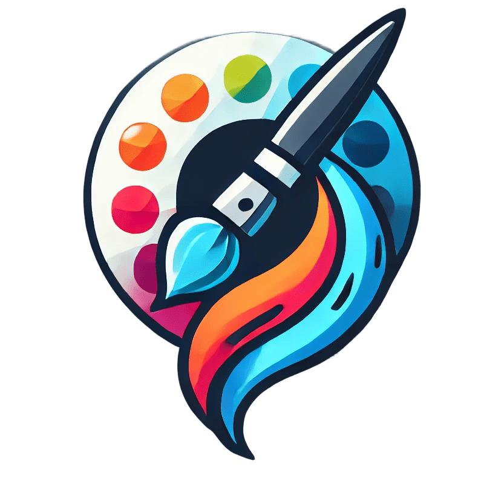

# ZeR Graphic Editor (ZRGE)

**Zer Graphic Editor (ZRGE)** is a simple raster graphic editor designed to work with the [ZPIF](https://github.com/Zer-Team/ZPIF), PNG and JPEG formats. Alpha channel is supported since version 1.0.3. Uses SFML 3.0.0 (since version 1.0.6). Distributed under the **GPLv3** license.

## Supported file formats

- [ZPIF](https://github.com/ZerTeam/ZPIF)
- PNG
- JPEG(JPG)

## Available hotkeys in the program
- **Q** - Eraser
- **E** - Brush
- **+** - Increase brush size
- **-** - Decrease brush size
- **R** - Drawing rectangles
- **O** - Drawing ovals
- **S** - Drawing stars
- **F** - Fill with color
- **C** - Clear canvas
- **CTRL** + **S** - Save image
- **CTRL** + **SHIFT** + **S** - Save the image with a new name