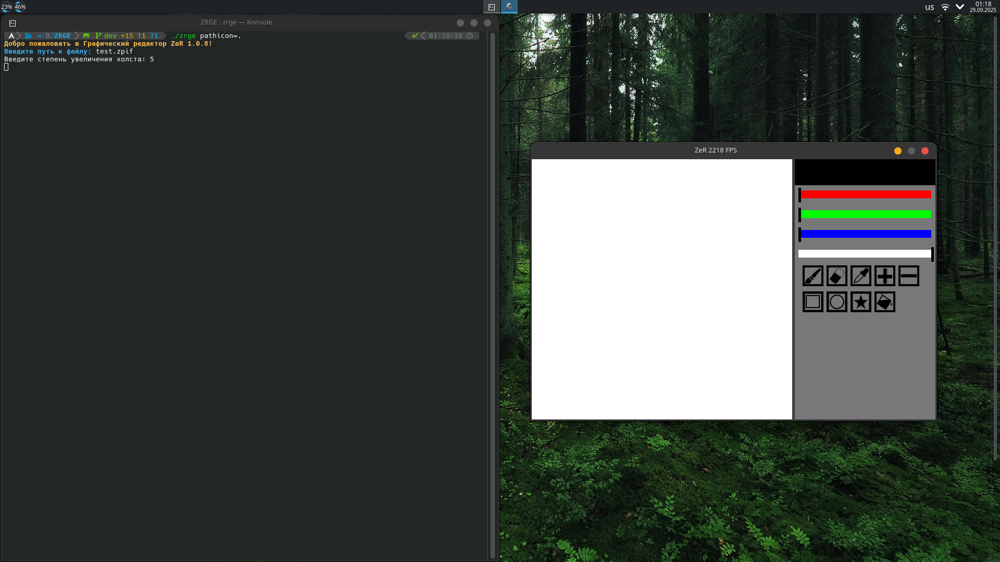
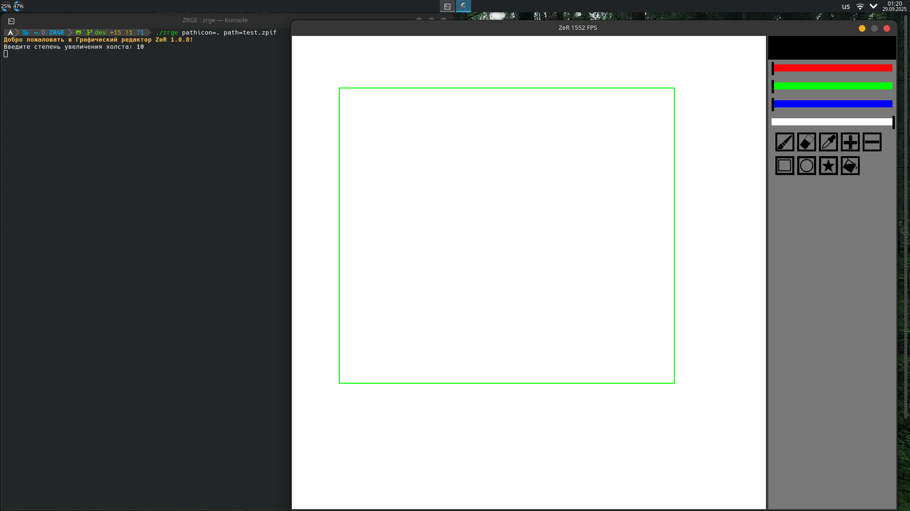
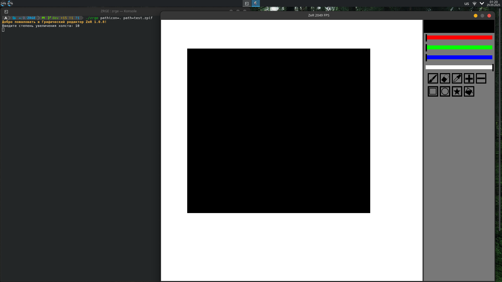
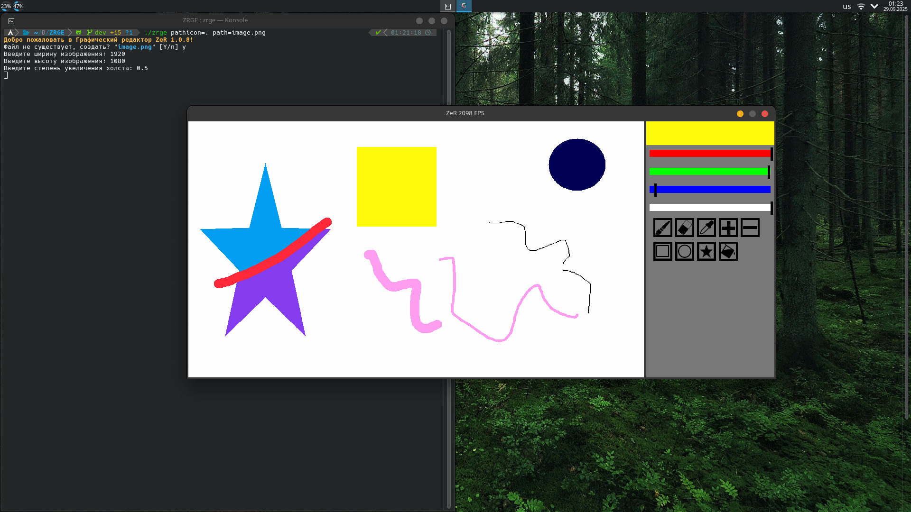
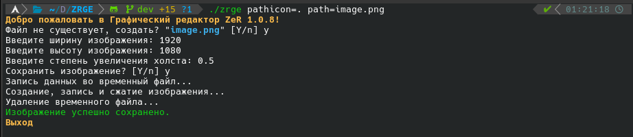

# ZeR Graphic Editor (ZRGE)


**ZeR Graphic Editor (ZRGE)** is a simple raster graphics editor designed to work with the [ZPIF](https://github.com/Zer-Team/ZPIF), PNG, and JPEG formats. Alpha channel is supported since version 1.0.3. Uses SFML 3.0.0 (since version 1.0.6). Distributed under the **GPLv3** license.

[](https://pay.cloudtips.ru/p/204a4487)

---

<p align="center">
  
</p>







## 📑 Table of Contents

- [Installation](#-installation)
- [Usage](#-usage)
- [Supported File Formats](#-supported-file-formats)
- [Hotkeys](#-hotkeys)
- [Available Languages](#-available-languages)

## 📥 Installation

1. **Download the latest release** from [Releases](https://github.com/Zer-Team/ZRGE/releases)  
   - `.deb` or `AppImage` for Linux. You can also use `AUR` for Arch Linux.

2. **Install ZRGE**  
   - Ubuntu/Debian: use the `.deb` package.  
   - Arch Linux: `yay -S zrge`.

3. **Run** `zrge` in a Linux terminal.

## 🖥️ Usage

Run ZRGE from the command line with optional flags:

```bash
zrge [options]
```

### Options

- `-v`, `--version` – Display the current version of ZRGE
- `-h`, `--help` – Show help information and available options
- `path={path to file}` – Open the specified image file at startup
- `lang={language}` – Set the program language (e.g., `lang=en` for English)
- `pathicon={path to icon folder}` – Specify a custom folder for icons

## 📂 Supported File Formats

- [ZPIF](https://github.com/Zer-Team/ZPIF)
- PNG
- JPEG (JPG)

## ⌨️ Hotkeys

- **`Q`** – Eraser
- **`E`** – Brush
- **`+`** – Increase brush size
- **`-`** – Decrease brush size
- **`R`** – Draw rectangles
- **`O`** – Draw ovals
- **`S`** – Draw stars
- **`F`** – Fill with color
- **`C`** – Clear canvas
- **`CTRL` + `S`** – Save image
- **`CTRL` + `SHIFT` + `S`** – Save image with a new name

## 🌐 Available Languages

ZRGE supports multiple interface languages. Use the corresponding language code with the `lang=` option:

- **English** – `en`
- **Russian** – `ru`
- **French**  – `fr`
- **German**  – `de`
- **Spanish** – `es`